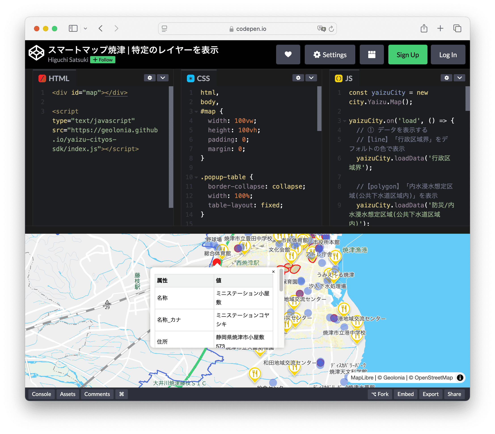

[スマートマップ焼津](https://maps.yaizu-smartcity.jp/)、および焼津都市情報APIを使うと、営利・非営利を問わず、地図と位置情報を活用したウェブサイトやアプリケーションを作ることができます。


## 「スマートマップ焼津」と「焼津都市情報API」 について

「スマートマップ焼津」と「焼津都市情報API」 は、焼津市が公開するサービスです。

市民、民間企業、学術団体が営利目的、非営利目的を問わず無料で利用し、地図と位置情報を活用したウェブサイトやアプリケーションを作ることができます。焼津市もこの地図とAPIを利用して、市民向けサービスの開発や業務の合理化を進めています。

この地図で表示・配信されている情報は、国土地理院の「地理院地図」、焼津市が保有している位置情報データをオープンデータとして公開しているものです。

現在公開している情報は、都市計画にかかわる情報、市の設備施設情報などで、かんたんな記述でみなさんのウェブサイトやアプリの地図上に表示できる他、APIでの取得もできます。

## クイックスタート

地図とデータを表示して、開発を始めましょう。

### 地図を表示する

**HTML**

```
<div id="map"></div>

<script type="text/javascript" src="https://city.geolonia.com/v1/shizuoka/yaizu/api.js"></script>
```

**CSS**

```
html, body, #map
{
  width: 100vw;
  height: 100vh;
  margin: 0;
  padding: 0;
}
```

**Javascript**

```
const myCity = new city.Yaizu.Map();
```

[Codepen で確認する](https://codepen.io/geolonia/pen/bNGOagR)

### 焼津市のデータを表示する

焼津市が[スマートマップ焼津](https://maps.yaizu-smartcity.jp/)公開しているデータを、地図上に表示できます。

**都市計画情報を表示する**

`loadData` メソッドを使って、地図上に[スマートマップ焼津](https://maps.yaizu-smartcity.jp/)で公開されているポリゴンデータを表示できます。

```
const myCity = new city.Yaizu.Map();

myCity.on('load', () => {  
  
  myCity.loadData('防災/内水浸水想定区域(公共下水道区域内)');
    
})
```

* 第一引数には、スマートマップ焼津に表示されているデータの `id` 文字列を入れてください。

**施設情報を表示する**

地図上に[スマートマップ焼津](https://maps.yaizu-smartcity.jp/)で公開されているポイントデータを表示できます。

まずは、[焼津市オープンデータ一覧](https://github.com/yaizu-city/opendata/) から表示したいデータを選びます。この例では、 `AED設置箇所一覧` を使います。

データ名列が「AED設置箇所一覧」の行、「GeoJSON」のリンク先をコピーします。

```
const myCity = new city.Yaizu.Map();

myCity.on('load', () => {
  // まず、GeoJSONデータを読み込みます。
  fetch("https://opendata.yaizu-fact.com/aed_location/data.geojson")
    .then((data) => data.json())
    .then((data) => {
      // GeoJSONのデータを地図に追加します。
      myCity.addSource('aed_location', {
        type: 'geojson',
        data: data,
      });

      // 次は、GeoJSONデータを表示させるための地図レイヤーを追加します。
      myCity.addLayer({
        id: 'aed_location_points',
        source: 'aed_location', // ←こちらは addSource の第一引数 'aed_location' と紐づけるための値です
        type: "circle",
        paint: {
          'circle-radius': 7,
          'circle-color': 'white',
          'circle-opacity': .8,
          'circle-stroke-width': 1,
          'circle-stroke-color': 'gray',
          'circle-stroke-opacity': 1,
        },
      });
    });
});
```

スタイルの設定は、 `addLayer` の `paint` 設定を使います。詳しくは、 [MapLibre GL JS のドキュメンテーション](https://maplibre.org/maplibre-gl-js-docs/style-spec/layers/#circle) を確認してください。


### 焼津都市情報APIのデータを取得する

以下のように地図上に表示している地物（ポリゴンや点）のデータを取得できます。

```
const myCity = new city.Yaizu.Map();

myCity.on("load", () => {
  myCity.loadData("ごみ・リサイクル/リサイクル拠点");

  myCity.on("click", (e) => {
    const features = myCity.queryRenderedFeatures(e.point, {
      layers: ["ごみ・リサイクル/リサイクル拠点"]
    });
    console.log(features.map(feature => feature.properties));
  });
});
```


[Codepen で触ってみる](https://codepen.io/geolonia/pen/bNGOagR)

## カスタマイズする

スマートマップ焼津は、Maplibre, Geolonia Maps と互換性があります。詳しいカスタマイズの方法は、[Intro - MapLibre GL JS](https://maplibre.org/maplibre-gl-js/docs/API/) を参照してください。

## 独自ドメインでホスティングする

スマートマップ焼津を、独自ドメインでホスティングする場合は焼津市にお問い合わせください。

問い合わせの際には、利用するドメイン名を伝えてください。その後 API キーを発行します。
API キーを使用して以下のようにスクリプトを読み込むことができます。

`https://city.geolonia.com/v1/shizuoka/yaizu/api.js?api-key=<APIキー>`


### 開発環境での利用

スマートマップ焼津は以下のドメインでは、APIキーの指定なしで利用できます。

* `http://127.0.0.1:*`
* `http://localhost:*`
* `https://*.test` (`http` も対応、全てのポート番号対応)
* `https://*.example` (`http` も対応、全てのポート番号対応)
* GitHub Pages（`https://*.github.io`） ※ 独自ドメインは対象外。
* Netlify (`https://*.netlify.com`, `https://*.netlify.app`) ※ 独自ドメインは対象外。
* Vercel (`https://*.vercel.app`) ※ 独自ドメインは対象外。
* [CodePen](https://codepen.io/)
* [JSFiddle](https://jsfiddle.net/)
* [CodeSandbox](https://codesandbox.io/)
* [PLAYCODE](https://playcode.io)
* [Web Maker](https://webmaker.app)

* URL は、スキーマも含めて一致する必要があります。たとえば、`http://127.0.0.1:8000` では利用可能ですが、 `https://127.0.0.1:8000` ではスキーマが違う (`http` と `https`) ため利用できません。

## ご利用にあたって

本サイトで公開している情報は、地図の精度上誤差を含んでいます。また、地図の利用目的に応じて、表示項目の取捨選択や地図の見やすさ等を考慮した表現を行っています。都市計画情報のうち、都市施設においては、都市計画決定した一部を掲載しているため、詳細については担当課（都市計画課）までお問合せください。
システムの利用により発生した直接的又は間接的な損失、損害等についてもいかなる責任を負うものではありません。

ご利用にあたっては、「[焼津オープンデータカタログ利用規約](https://yaizu-smartcity.jp/%E7%84%BC%E6%B4%A5%E3%82%AA%E3%83%BC%E3%83%95%E3%82%9A%E3%83%B3%E3%83%86%E3%82%99%E3%83%BC%E3%82%BF%E3%82%AB%E3%82%BF%E3%83%AD%E3%82%AF%E3%82%99%E5%88%A9%E7%94%A8%E8%A6%8F%E7%B4%8420250306.pdf)」に同意の上、ご利用ください。
